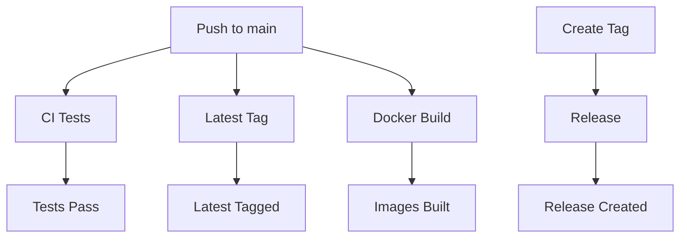

# GitHub Actions Workflows

This directory contains GitHub Actions workflows for the ISR Datasets project.

## Workflows

### 1. CI (`ci.yml`)
**Trigger**: Push to main/master/develop branches, Pull Requests
**Purpose**: Continuous Integration - runs tests, linting, and basic Docker build validation

**Features**:
- Python tests with PostgreSQL service
- Code linting with flake8
- Docker image build test
- Basic container health check

### 2. Docker Build and Push (`docker-build.yml`)
**Trigger**: Push to main/master branches, version tags, Pull Requests
**Purpose**: Builds and pushes Docker images to GitHub Container Registry

**Features**:
- Builds both main application and nginx images
- Tags images with branch names, PR numbers, and semantic versions
- **Automatically tags with `latest` for default branch pushes**
- Uses Docker Buildx for multi-platform builds
- Implements build caching for faster builds

### 3. Release (`release.yml`)
**Trigger**: Version tags (v*), Manual dispatch
**Purpose**: Creates releases with proper versioning and latest tags

**Features**:
- Builds and pushes versioned images
- **Always tags with `latest` for releases**
- Creates GitHub releases with detailed information
- Supports manual workflow dispatch
- Includes proper OCI labels

### 4. Latest Tag (`latest-tag.yml`)
**Trigger**: Push to main/master branches
**Purpose**: Ensures latest tag is always updated on main branch

**Features**:
- **Specifically focuses on `latest` tag**
- Builds both main application and nginx images
- Tags with both `latest` and commit SHA
- Provides build summary in GitHub Actions

## Key Features

### Latest Tag Strategy
All workflows ensure that the `latest` tag is properly maintained:

1. **Main Branch**: `latest-tag.yml` updates `latest` on every push to main
2. **Releases**: `release.yml` tags `latest` for all version releases
3. **General Builds**: `docker-build.yml` tags `latest` for default branch

### Image Naming
- **Main Application**: `ghcr.io/owner/repo:latest`
- **Nginx**: `ghcr.io/owner/repo-nginx:latest`

### Usage Examples

```bash
# Pull latest images
docker pull ghcr.io/your-org/isr-datasets:latest
docker pull ghcr.io/your-org/isr-datasets-nginx:latest

# Run with docker-compose
docker-compose up -d

# Run directly
docker run -d ghcr.io/your-org/isr-datasets:latest
```

## Configuration

### Required Secrets
- `GITHUB_TOKEN` (automatically provided)

### Environment Variables
- `REGISTRY`: GitHub Container Registry (`ghcr.io`)
- `IMAGE_NAME`: Repository name (automatically set)

## Workflow Dependencies



## Best Practices

1. **Always test locally** before pushing to main
2. **Use semantic versioning** for releases (v1.0.0, v1.1.0, etc.)
3. **Monitor workflow runs** for any failures
4. **Keep Dockerfiles optimized** for faster builds
5. **Use proper commit messages** for better release notes
