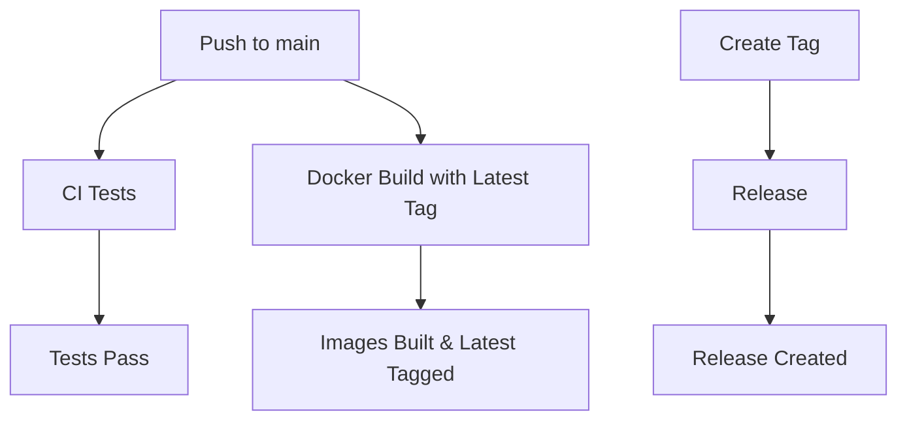

# GitHub Actions Workflows

This directory contains GitHub Actions workflows for the ISR Datasets project.

## Workflows

### 1. Comprehensive Tests (`test.yml`)
**Trigger**: Push to main/master/develop branches, Pull Requests, Manual dispatch
**Purpose**: Complete test suite with multiple testing phases

**Features**:
- ✅ **Unit Tests** - All Django tests with PostgreSQL
- ✅ **Code Linting** - Black, isort, Flake8
- ✅ **Security Checks** - Safety, Bandit
- ✅ **Docker Tests** - Container functionality
- ✅ **Integration Tests** - End-to-end testing
- ✅ **Performance Tests** - Load testing (PR only)
- ✅ **Coverage Reports** - Code coverage analysis

### 2. Quick Tests (`quick-test.yml`)
**Trigger**: Push to main/master/develop branches, Pull Requests, Manual dispatch
**Purpose**: Fast development tests for quick feedback

**Features**:
- ⚡ **Fast Execution** - Uses SQLite for speed
- 🔄 **Quick Feedback** - Essential tests only
- 📧 **Notification Tests** - Email functionality
- 👤 **User Tests** - Authentication
- 📊 **Dataset Tests** - Core functionality

### 3. Docker Build and Push (`docker-build.yml`)
**Trigger**: Push to main/master branches, version tags, Pull Requests
**Purpose**: Builds and pushes Docker images to GitHub Container Registry

**Features**:
- Builds both main application and nginx images
- Tags images with branch names, PR numbers, and semantic versions
- **Automatically tags with `latest` for default branch pushes**
- Uses Docker Buildx for multi-platform builds
- Implements build caching for faster builds
- Provides build summary in GitHub Actions
- **Combined latest-tag functionality for streamlined CI/CD**

### 4. Release (`release.yml`)
**Trigger**: Version tags (v*), Manual dispatch
**Purpose**: Creates releases with proper versioning and latest tags

**Features**:
- Builds and pushes versioned images
- **Always tags with `latest` for releases**
- Creates GitHub releases with detailed information
- Supports manual workflow dispatch
- Includes proper OCI labels

## 🧪 Test Coverage

### Test Categories
- **User Management Tests**
  - User creation and authentication
  - Role-based permissions
  - Email verification
  - Password reset functionality

- **Dataset Management Tests**
  - CRUD operations
  - File upload handling
  - Version management
  - Project associations
  - Publisher relationships

- **Notification System Tests**
  - Comment notifications
  - Dataset update notifications
  - New version notifications
  - Email template validation
  - Exception handling
  - User preference respect

- **Integration Tests**
  - End-to-end workflows
  - Database migrations
  - Static file collection
  - System health checks

### Test Databases
- **Comprehensive Tests:** PostgreSQL 15 (production-like)
- **Quick Tests:** SQLite (fast execution)
- **Docker Tests:** Built-in database

## Key Features

### Latest Tag Strategy
All workflows ensure that the `latest` tag is properly maintained:

1. **Main Branch**: `docker-build.yml` updates `latest` on every push to main
2. **Releases**: `release.yml` tags `latest` for all version releases
3. **General Builds**: `docker-build.yml` tags `latest` for default branch

### Image Naming
- **Main Application**: `ghcr.io/owner/repo:latest`
- **Nginx**: `ghcr.io/owner/repo-nginx:latest`

### Usage Examples

```bash
# Pull latest images
docker pull ghcr.io/your-org/isr-datasets:latest
docker pull ghcr.io/your-org/isr-datasets-nginx:latest

# Run with docker-compose
docker-compose up -d

# Run directly
docker run -d ghcr.io/your-org/isr-datasets:latest
```

## Configuration

### Required Secrets
- `GITHUB_TOKEN` (automatically provided)

### Environment Variables
- `REGISTRY`: GitHub Container Registry (`ghcr.io`)
- `IMAGE_NAME`: Repository name (automatically set)

## Workflow Dependencies



## Best Practices

1. **Always test locally** before pushing to main
2. **Use semantic versioning** for releases (v1.0.0, v1.1.0, etc.)
3. **Monitor workflow runs** for any failures
4. **Keep Dockerfiles optimized** for faster builds
5. **Use proper commit messages** for better release notes
